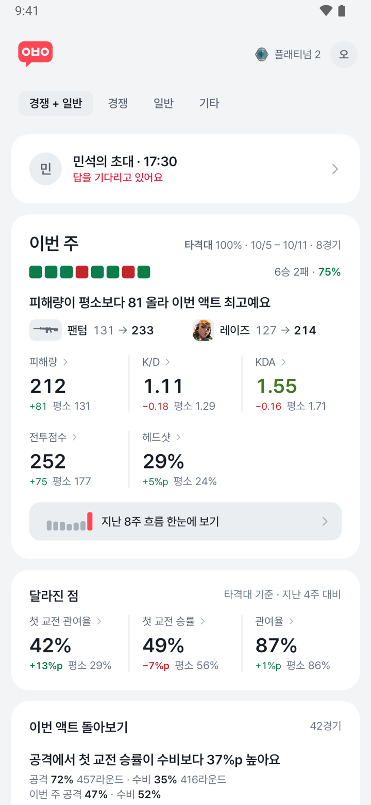
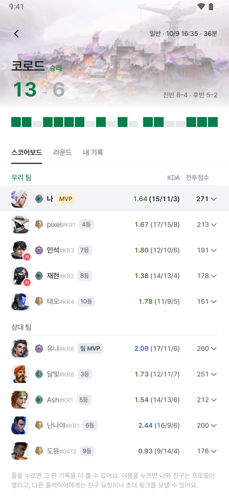
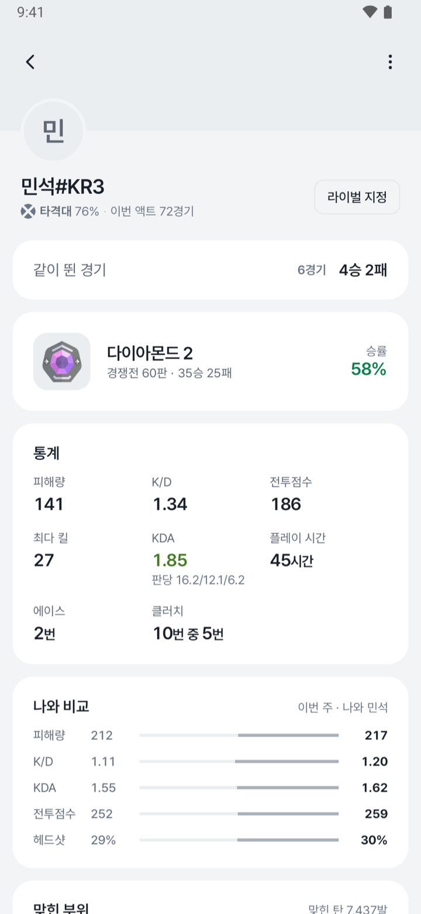
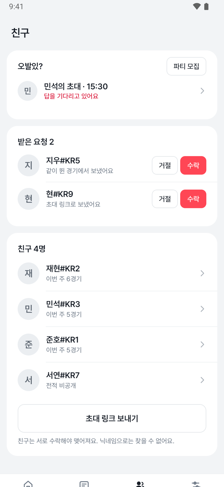
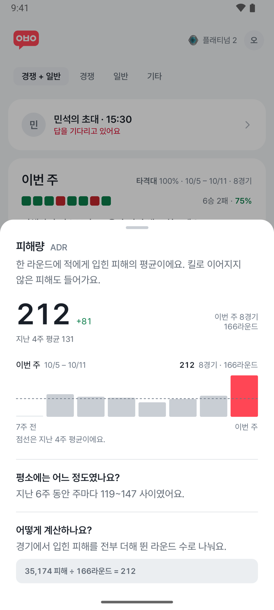
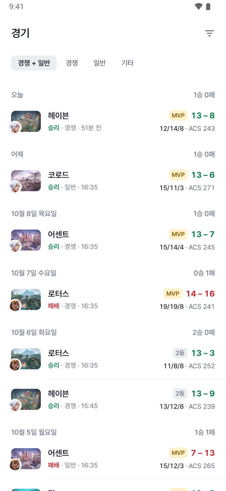
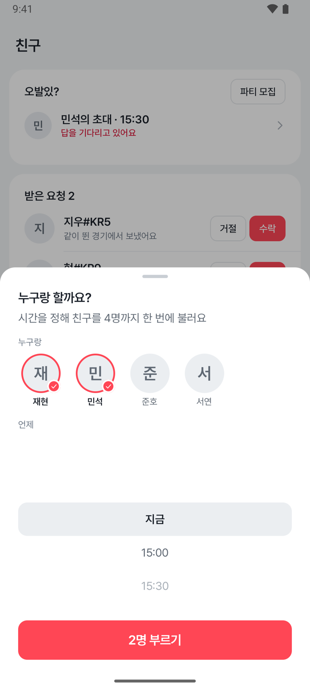
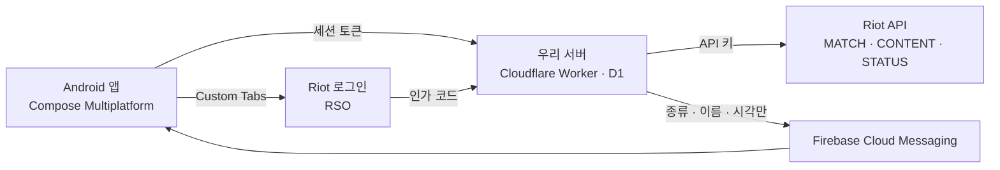

# 오발있

발로란트를 하고 나서 "이번 주는 왜 이렇게 안 풀렸지" 싶을 때 여는 앱이다. 최근 경기를 평소의 나와 견줘, 그 주에
정말로 달라진 것만 짚어 준다.

[클릭형 프로토타입](https://sjunh812.github.io/ovalit/prototype/) · [화면 규칙](screens.md) · [결정 기록](DECISIONS.md)

  
  
  
  

| | |
| --- | --- |
| 플랫폼 | Android, Google Play 한국 출시 예정. iOS는 같은 코드로 시뮬레이터에서만 돌려 본다 |
| 지금 상태 | 모든 화면이 가짜 데이터로 동작한다. Riot 프로덕션 키 심사를 기다리는 중이다(2026년 9월 19일 신청) |
| 데이터 | Riot 공식 API만 쓴다. VAL-MATCH-V1, VAL-CONTENT-V1, VAL-STATUS-V1, 로그인은 RSO |
| 비용 | 출시 전까지 0원. 서버와 도구는 모두 무료 한도 안에서 돈다 |

이 문서는 2026년 10월 기준이다. 화면마다의 세부 규칙은 [`screens.md`](screens.md), 지표 계산 규칙은 저장소 루트의
`CLAUDE.md`에 있고, 여기서는 왜 이렇게 만들었는지를 적는다.

## 왜 만드나

전적 사이트는 숫자를 많이 보여 준다. 그런데 "그래서 이번 주에 뭐가 달라졌는데?"에는 답하지 않는다. 지난주보다 헤드샷이
3%p 내려갔다는 숫자만 봐서는 실력이 떨어진 건지, 오퍼레이터를 많이 들어서 그런 건지, 원래 그 정도는 매주 오르내리는
건지 알 수 없다.

발로란트는 전적이 기본 비공개다. 롤처럼 아무 닉네임이나 검색해 볼 수 없고, Riot 정책은 비교 기준을 본인의 과거로
제한한다. 남들 사이에서 몇 등인지, 여러 지표를 섞은 점수 같은 건 만들 수 없다. 그래서 오발있은 남을 찾아보는 앱이 아니라
나를 따라가는 앱으로 만들었다. 대신 서로 수락한 친구와는 같은 지표를 나란히 놓고 볼 수 있다.

앱 이름은 "오늘 발로란트 할 사람 있어?"를 줄인 말이다. 로고 `ㅇㅂㅇ`도 그 초성이다. 돌아보기 앱에 붙은 이름치고는 놀자는
말에 가까운데, 혼자 기록만 보는 앱이 아니라 친구와 같이 쓰는 앱이라는 뜻으로 그대로 두었다.

## 누가, 언제 쓰나

주에 경쟁전과 일반전을 몇 판에서 열몇 판 하고, 같이 큐를 도는 친구가 두세 명쯤 있는 사람이다. 프로 지망생보다는 진
판을 혼자 곱씹는 사람에 가깝다.

> 금요일 밤에 세 판을 내리 지고 앱을 연다. 홈 맨 위에 "피해량이 평소보다 81 올라 이번 액트 최고예요"가 떠 있고,
> 바로 밑에 그 변화를 끌어올린 팬텀(131 → 233)과 레이즈(127 → 214)가 적혀 있다. 졌어도 내 플레이가 무너진 건
> 아니었다는 걸 숫자로 확인한다. 달라진 점 칸에서는 첫 교전 승률이 평소보다 7%p 낮다. 칸을 누르니 지난 8주 막대와
> 계산식이 나온다. 그다음 친구 탭에서 토요일 밤 9시에 같이 할 사람을 부른다.

## 무엇을 하나

### 주간 리포트

홈은 한 주를 한 장으로 돌아보는 화면이다. 위에서부터 이렇게 읽힌다.

- 승패 칸 바로 밑에 그 주에 가장 크게 움직인 고정 지표를 한 문장으로 적는다("피해량이 평소보다 81 올라 이번 액트
  최고예요"). 평소 흔들림 안의 변화는 문장으로 짚지 않는다.
- 그 밑에 변화를 가장 크게 끌어간 무기와 요원을 붙인다. 실력보다 판 구성이 바뀐 탓이면 "이코 라운드 비중 16% → 31%"처럼
  그쪽을 먼저 적는다.
- 피해량, K/D, KDA, 전투점수, 헤드샷 다섯 칸은 매주 같은 자리에 둔다. 매주 다른 숫자만 뜨면 자기 성적이 어떻게 흘러가는지
  따라갈 수 없다. 숫자 밑에는 "+81 · 평소 131"처럼 변화량과 비교 기준을 붙인다.
- 달라진 점 카드에는 관여율, 첫 교전 승률, 이코 승률 같은 후보 열한 개 가운데 그 주에 실제로 움직인 것을 세 개에서 다섯
  개 올린다. 처음에 관심사(에임, 라운드 운영, 기복)를 골랐으면 그 지표가 맨 앞에 온다.
- 라벨은 전투점수, 피해량, 관여율처럼 한글로 쓴다. 칸을 누르면 정식 명칭(ACS, ADR, KAST)과 계산식, 표본, 지난 8주 막대가
  시트로 올라온다.

 

### 경기 돌아보기

경기 탭은 날짜별로 묶고 머리에 그날의 승패를 적는다. 경기 상세는 스코어보드, 라운드, 내 기록 세 탭이다. 라운드 탭에서는
라운드를 하나씩 골라 두 팀의 구매 유형(이코, 포스바이, 풀바이)과 장비, 그 라운드의 내 기록과 킬 순서를 본다. 내 기록
탭에서는 맞힌 부위와 상대 다섯 명과의 맞대결(잡은 수, 잡힌 수, 주고받은 피해)을 본다.

스코어보드에서 이름을 누르면 친구는 프로필이 열린다. 친구가 아니면 앱을 쓰는 사람에게는 친구 요청을, 안 쓰는 사람에게는
초대 링크를 보낼 수 있다. 앱을 안 쓰는 사람은 그 경기 안의 기록까지만 보인다.

데스매치나 건틀릿처럼 규칙이 다른 모드는 목록에만 두고 리포트 평균에는 넣지 않는다. 다시 살아나는 모드의 K/D를 경쟁전과
같은 잣대로 볼 수는 없다.

 

### 친구

친구는 같이 뛴 경기의 스코어보드나 초대 링크로만 맺고, 서로 수락해야 한다. 닉네임 검색은 없다.

- 라이벌을 한 명 고르면 고정 다섯 칸을 매주 겨룬다.
- 친구 비교는 지표 하나를 골라 친구들 사이에서만 줄을 세운다. 친구가 많으면 위 다섯 줄과 내 줄만 두고 나머지는 전체 순위
  화면에서 본다.
- 친구 프로필은 남의 전적 페이지가 아니라 나와의 관계 페이지다. 맨 위에 같이 뛴 경기("6경기 4승 2패")가 있고, 이번 주
  지표를 나와 나란히 놓는다.
- "오발있?" 카드에서 친구를 네 명까지 시각을 정해 부른다. 받은 사람은 갈게요, 다른 시간, 못 가요 가운데 하나로 답하고,
  알림 버튼으로 앱을 열지 않고도 답할 수 있다. 글을 적는 칸은 없다.

 

### 내 기록

내 프로필에는 이번 액트 티어, 통계, 맞힌 부위, 요원, 무기가 있다. 무기 화면은 계열별로 묶고 이번 주 위쪽 세 무기를 평소와
견주고, 요원 화면은 많이 한 순서대로 승률과 KDA를 보여 준다.

## "달라졌다"를 정하는 법

매주 조금씩 흔들리는 숫자와 정말로 달라진 숫자를 가르는 게 이 앱에서 가장 공들인 부분이다. 흔들림까지 다 짚으면 매주
경고가 뜨고, 얼마 지나면 아무도 읽지 않는다.

| 무엇 | 어떻게 |
| --- | --- |
| 비교 기준 | 집계 기간 바로 앞 4주의 평균. 같은 액트 안에서만 센다. 액트마다 랭크가 초기화되고 매칭이 달라진다 |
| 움직였다 | 이번 값과 평균의 차이가 지난 8주 주간 값의 표준편차보다 1.5배 넘게 클 때. 그런 주가 4주 이상 있어야 판단한다 |
| 표본 | 지표마다 최소 표본이 있다. 관여율과 생존율은 40라운드, 첫 킬 승률은 첫 킬 10번, 이코 승률은 이코 라운드 15번 |
| 기간 | 이번 주를 먼저 보고, 다섯 경기가 안 되면 한 주씩 넓혀 4주까지 본다. 넓혔으면 카드에 기간을 적는다 |
| 역할 | 같은 첫 교전 관여율 12%도 전략가면 정상이고 타격대면 문제다. 그 주에 가장 많이 한 역할에 따라 앞세울 지표가 달라진다 |

계산에서는 몇 가지를 꼭 지킨다.

- 경기마다 비율을 낸 뒤 평균하지 않고, 총량을 모두 더한 뒤에 나눈다. 13대2로 끝난 판과 13대11까지 간 판이 같은 무게로
  섞이면 안 된다.
- 분모가 0이면 칸을 비운다. 0%로 채우면 틀린 숫자가 된다.
- 변화량은 화면에 보이는 자릿수끼리 뺀다. 74%와 69%를 나란히 띄워 놓고 +6이라고 적으면 틀려 보인다.
- 튕겨서 못 뛴 라운드는 세지 않는다. 세이지 부활로 한 라운드에 두 번 죽으면 데스는 2다.

1.5배와 최소 표본은 공식 기준이 없어서 정한 시작값이다. 실데이터가 들어오면 다시 맞춘다.

## 하지 않는 것

Riot의 프로덕션 키 승인 조건이자, 이 앱이 전적 검색 앱이 되지 않게 막는 선이다.

| 하지 않는 것 | 까닭 |
| --- | --- |
| 여러 지표를 섞은 종합 점수 | MMR을 대신하는 점수로 읽힌다 |
| "상위 n%" 같은 분포 속 등수 | 같은 까닭이다. 비교는 본인의 과거와, 서로 수락한 친구끼리만 한다 |
| 닉네임 검색 | 발로란트 전적은 기본 비공개다. 친구는 같이 뛴 경기나 초대 링크로만 맺는다 |
| 스카우팅, 상점 조회, 인게임 오버레이, 닉변 이력 | Riot이 승인하지 않는 용도다 |
| "밴달 쓰세요" 같은 결정 대행 | 사실만 적고 고르는 건 플레이어 몫으로 둔다. "추천"이라는 말도 쓰지 않는다 |
| 앱을 안 쓰는 사람의 다른 경기, 통산 승률, 티어 추이 | 내가 같이 뛴 경기 안의 기록까지만 보여 준다 |

## 개인정보와 공개 범위

- 로그인은 Riot 공식 로그인(RSO)을 Chrome Custom Tabs로 띄운다. 앱은 비밀번호를 만지지 않고, 인가 코드는 서버가 바꿔 앱은
  우리 서버의 세션 토큰만 든다.
- 연동 동의 화면에서 친구에게 전적이 공개된다는 걸 먼저 알린다. 전적 공개는 설정에서 끌 수 있고, 서버가 이 값을 보고
  친구에게 경기를 내준다.
- 내가 안 뛴 친구 경기를 내려줄 때는 친구와 나 말고 모두 가린다. 가린 사람의 줄에는 남겨도 되는 필드만 둔다.
- 연동을 해제하면 저장된 경기와 리포트, 쌓인 사용 통계를 지운다.
- 사용 통계와 비정상 종료 보고에는 Riot이 준 값(PUUID, 닉네임, 지표)을 넣지 않는다.

## 성공 기준

출시 뒤 4주 동안 첫 값을 보고 목표치를 정한다. 지금 정해 둔 건 무엇을 볼지다. 모두 앱이 이미 보내는 사용 통계로 잴 수 있다.

| 무엇을 보나 | 왜 | 재는 법 |
| --- | --- | --- |
| 연동을 시작한 사람 중 첫 수집까지 마친 비율 | 첫 리포트를 못 보면 앱의 가치를 볼 일도 없다 | 동의 화면 `screen_view` 대비 `tutorial_complete` |
| 홈을 한 주에 이틀 넘게 연 사람의 비율 | 주간 리포트가 습관이 됐는지 본다 | `screen_view`(`report`) |
| 연동 4주 안에 친구를 한 명 이상 맺은 비율 | 라이벌, 친구 비교, 파티 모집이 모두 친구에서 시작한다 | `friend_request`(`accept`), `share` |
| 파티 모집에 답한 비율 | 친구 기능이 실제로 같이 하는 데 쓰이는지 본다 | `ping_send`의 `friend_count` 대비 `ping_reply` |

함께 지켜볼 것은 비정상 종료 없이 끝난 세션 비율(Crashlytics), 서버가 Riot에서 받은 429 수와 D1 하루 쓰기 양이다. 레이트
리밋과 무료 한도는 사용자 한 사람이 아니라 앱 전체에 걸린다.

## 범위와 순서

### 지금 된 것

모든 화면이 가짜 데이터로 돌아간다. 서버(Cloudflare Worker)는 로그인, 친구, 파티 모집을 맡고, Riot 요청을 대신 보내면서
남의 기록을 가린다. Riot 경기 응답을 앱 모델로 옮기는 코드는 문서의 스키마로 먼저 만들어 두었다. 테스트는 앱 쪽 1,300여
개와 서버 250개이고 GitHub Actions에서 돈다.

### Riot 승인 뒤

1. RSO 클라이언트를 받아 로그인을 붙인다.
2. 경기 받기 저장소에서 가짜 서버와 메모리 저장만 실제 서버와 기기 DB로 바꾼다. 받기 규칙과 테스트는 그대로 쓴다.
3. 실제 응답으로 짐작해 둔 것들을 확인한다(아래 "아직 정하지 못한 것").
4. Play 내부 테스트를 거쳐 출시한다.

### 수익

모든 기능은 무료다. 광고는 Riot 개발자 포털에서 제품이 승인된 뒤, 제품 설명에 광고를 적고 나서 붙인다.

## 기술 구성

- 앱은 Kotlin Multiplatform과 Compose Multiplatform으로 쓰고 Android로 출시한다. 같은 코드가 iOS 시뮬레이터에서도 돈다.
- Riot API 키와 RSO 비밀값은 서버에만 있다. 끝난 경기는 결과가 바뀌지 않으니 한 번 받으면 다시 요청하지 않는다. Riot 레이트
  리밋은 앱 전체가 나눠 쓰기 때문이다.
- 서버, 푸시, 사용 통계, CI 모두 무료 한도 안에서 돈다. 출시 전에 드는 돈은 Google Play 개발자 등록비 25달러 하나다.

## 아직 정하지 못한 것

- 전투점수 칸을 그대로 둘지. 13.06 패치(2026년 9월 22일)부터 게임 스코어보드는 ACS 대신 Performance Score를 띄운다. 실제
  경기 응답에 무엇이 오는지 보고 정한다.
- 실데이터로 확인할 것들. 라운드 번호가 0부터인지 1부터인지, 항복한 라운드가 어떻게 오는지, 맵 ID가 UUID인지 경로인지,
  2~3라운드로 끝난 리메이크를 경기로 셀지.
- 1.5배, 최소 표본, 트레이드 5초 같은 시작 기준선. 실데이터의 분포를 보고 다시 맞춘다.
- 친구 비교 숫자를 어디서 셀지. 친구 경기를 모두 받으면 레이트 리밋을 친구 수만큼 나눠 쓰게 되어서, 각자 앱이 올린 주간
  요약으로 세는 쪽으로 계획만 세워 두었다.

## 더 보기

| 문서 | 내용 |
| --- | --- |
| [`screens.md`](screens.md) | 화면마다 무엇을 어디에 두는지 |
| [`design.md`](design.md) | 색, 글자, 면, 움직임 |
| [`backend.md`](backend.md) | 서버 규칙 |
| [`DECISIONS.md`](DECISIONS.md) | 기획과 달라진 결정, 날짜와 까닭 |
| [`CONVENTIONS.md`](CONVENTIONS.md) | 글, 커밋, 테스트, 빌드 규칙 |

---

화면은 모두 가짜 데이터다. Ovalit isn't endorsed by Riot Games and doesn't reflect the views or opinions of Riot Games or
anyone officially involved in producing or managing Riot Games properties. Riot Games, and all associated properties are
trademarks or registered trademarks of Riot Games, Inc.
